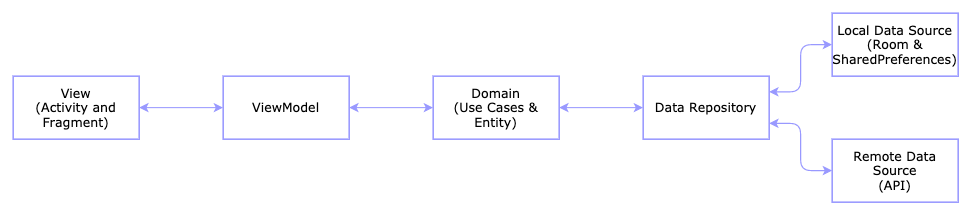

# Foories - Android
Food Classification, Detection, and Calories Measurement

## Description
Branch for Foories  Android application. Contains architecture, used library, and steps to reproduce

## Table of Content

- [Used Library](#used-library)
- [Architecture](#architecture)
- [Step to Reproduce](#step-to-reproduce)

### Used Library 
Foories use some library to support the functionality of the application
1. Viewpager2 (1.0.0)

	For building an interactive and lightweight onboarding screen 
	
2. Kotlin Coroutine Android (1.5.0-native-mt)

	To support kotlin concurrency 
	
3. Koin (3.0.2)

	Android dependency injection library
	
4. Activity KTX (1.2.3)

	Jetpack library to support ViewModel binding with activity
	
5. Retrofit (2.9.0)

	Networking library to handle Network Call and communicate with web server
	
6. Retrofit Converter Gson (2.9.0)

	Retrofit extension library to parse Javascript Object Notation (JSON) data
	
7. Room (2.3.0)

	Jetpack Library to handle in-app database
	
8. Dexter (6.2.2)

	Android permission library
	
9. Custom Tensorflow Lite Library
 
	 a Tensorflow lite library built from scratch that suitable only for the given model. Has 10 times smaller size than original tensorflow lite library
	 
10. Google Firebase

	Google library to support application analytic and crash monitor

### Architecture
Foories android application implements Clean Architecture combining with Model-View-ViewModel (MVVM) Pattern which is recommended by google and as a part of Android Jetpack. For illutration, you can see bellow

### Step to Reproduce

1. Clone this repository
2. Checkout 'android' branch
3. Open with Android Studio or any IDE for android development
4. Wait for the gradle to be sync
5. Launch the app
